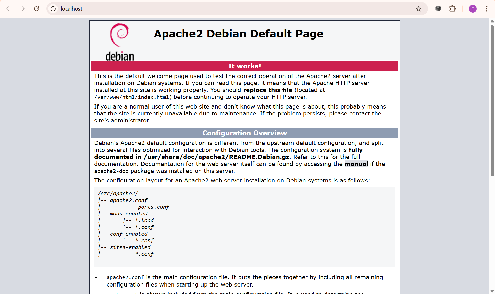

# Unit 3 - Dockerfile and Docker Hub

## Apache HTTP Server (Docker)

## Overview

The objective of this project is to build a custom Docker image running an Apache HTTP Server, publish it to Docker Hub, and execute it locally as a containerized web server. It focus only on image creation, not orchestration.

## Learning Objectives

    - Create a custom Docker image using a Dockerfile
    - Understand the Docker image lifecycle
    - Run containers from a custom image
    - Publish images to Docker Hub
    - Access a containerized web server locally

## Architecture

Client (Browser) → Docker Container (Apache HTTP Server) → Port Mapping (80 → 80)

## Technologies

    - Docker
    - Debian
    - Apache HTTP Server
    - Docker Hub

## Configuration

The Dockerfile performs the following steps:

- Uses the latest stable **Debian slim** image
- Updates the package repository
- Installs **Apache2**
- Runs Apache in the foreground (required for containers)
- Exposes port **80**

```dockerfile
FROM debian:trixie-slim

RUN apt-get update && \
    apt-get upgrade && \
    apt-get install -y apache2

CMD ["apachectl", "-D", "FOREGROUND"]

EXPOSE 80
```

## How to Run

1. After cloning this repo, run the following command to build the new docker image:
docker build -t <dockerhub_username>/httpserver .

2. To see the image run:
docker image ls

3. Next, we can run the container via:
docker run -d -p 80:80 <dockerhub_username>/httpserver

4. Now the container is in execution and can be access by:
http://localhost

5. The expected page is the Apache Debian default page 



6. Then, run the command below to stop the container in a detached way:
docker stop <container_id | container_name>

7. If you want you can upload this image to your own Docker Hub, so that we can access it from a different computer, context, environment, etc.
docker push <your_dockerhub_username>/httpserver

## Troubleshooting

Just in case you are not allowed to access it you will receive an error message like "unauthorized: authentication requited". In this case you need to authenticate to your dockerhub account via
`docker login`

Now you can safely try to push your image again repeating the step 7.